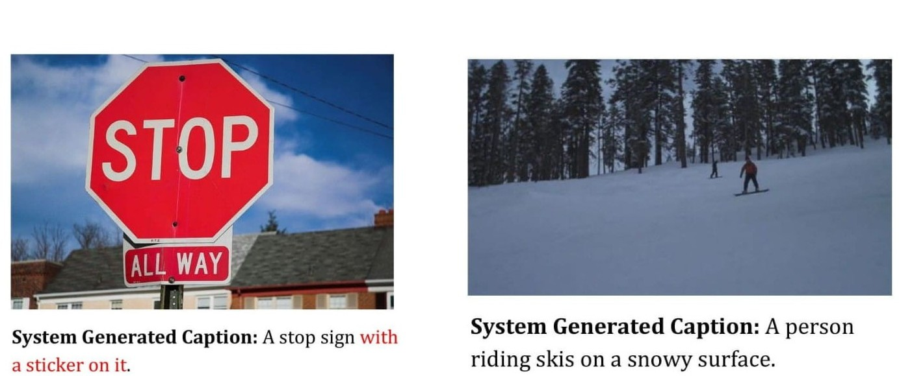

# Topic-Based-Image-Captioning

Describing an image efficiently requires extracting as much information from it as possible. Apart from detecting the presence of objects in the image, their respective purpose intending the topic of the image is another vital information which can be incorporated with the model to improve the efficiency of the caption generation system. The sole aim is to put extra thrust on the context of the image imitating human approach. The model follows encoder-decoder framework with topic input. The method is compared with some of the state-of-the-art models based on the result obtained from MSCOCO 2017 dataset. BLEU, CIDEr, ROGUE-L, METEOR scores are used to measure the efficacy of the model which shows improvement in performance of the caption generation process.

## Core Dependencies

- Python 3.6
- Tensorflow
- Numpy
- NLTK
- OpenCV

## Model Training and Evaluation

### Installing Requirements

1. Install the packages mentioned in `requirements.txt` in a **python 3.6** environment.
2. Install the _stopwords_ package from NLTK  
   `$ python -m nltk.downloader stopwords`

### Data Preparation

1. Go to the directory `dataset`.
2. Inside the directory, download and the MSCOCO 2017 _Train_ and _Val_ images along with _Train/Val_ annotations from [here](http://cocodataset.org/#download) and then extract them.
3. Download the **glove.6B.zip** file from [here](https://nlp.stanford.edu/projects/glove/). Then extract the file _glove.6B.300d.txt_ from the downloaded file.
4. Create a simplified version of MSCOCO 2017 dataset  
   `$ python dataset/parse_coco.py`

### Topic model training

1. To process the dataset for training the topic model  
   `$ python dataset/create_topic_dataset.py`
2. Train the lda model  
   `$ python lda_model_train.py`
3. Train the topic model  
   `$ python topic_lda_model_train.py`

### Caption model training

1. To process the dataset for training the caption model
   `$ python dataset/create_caption_dataset.py --image_weights <path to the weights of the topic model>`
2. Train the caption model
   `$ python caption_model_train.py --image_weights <path to the weights of the topic model>`

### Generate Predictions

Generate model predictions  
`$ python evaluation/caption_model_predictions.py --image_weights <path to the weights of the topic model> --model_weights <path to the weights of the caption model>`  
The file generated after executing the above script is used for generation of evaluation scores below.

### Evaluation

Evaluation scores are generated using the code provided [here](https://github.com/tylin/coco-caption).

1. Clone the above mentioned [repo](https://github.com/tylin/coco-caption).
2. Copy the directories _pycocotools/_ and _pycocoevalcap/_, and the file _get_stanford_models.sh_ from the above repo into the _evaluation/_ directory.
3. Copy the annotations file _captions_train2017.json_ from the MSCOCO 2017 dataset into the _evaluation/annotations/_ directory.
4. Create a **new virtual environment in python 2.7** and activate it.
5. Install requirements  
   `$ pip install -r evaluation/requirements.txt`
6. Run the code in the notebook _generate_evaluation_scores.ipynb_ to obtain the evaluation scores.

## Results

### Scores

| Metric  | Score |
| ------- | ----- |
| BLEU-1  | 0.669 |
| BLEU-2  | 0.493 |
| BLEU-3  | 0.353 |
| BLEU-4  | 0.252 |
| CIDEr   | 0.822 |
| ROUGE-L | 0.498 |
| METEOR  | 0.232 |

### Examples

## Detailed Description

For more information about the model, refer to the following links:

- [Poster](https://drive.google.com/file/d/1odJeqj5EItknM5pVNxITA254OAXWix3c/view?usp=sharing)
- [Presentation](https://drive.google.com/open?id=1evzv-GfNHfksI_vcnUyBSKghP4m539yJ)
